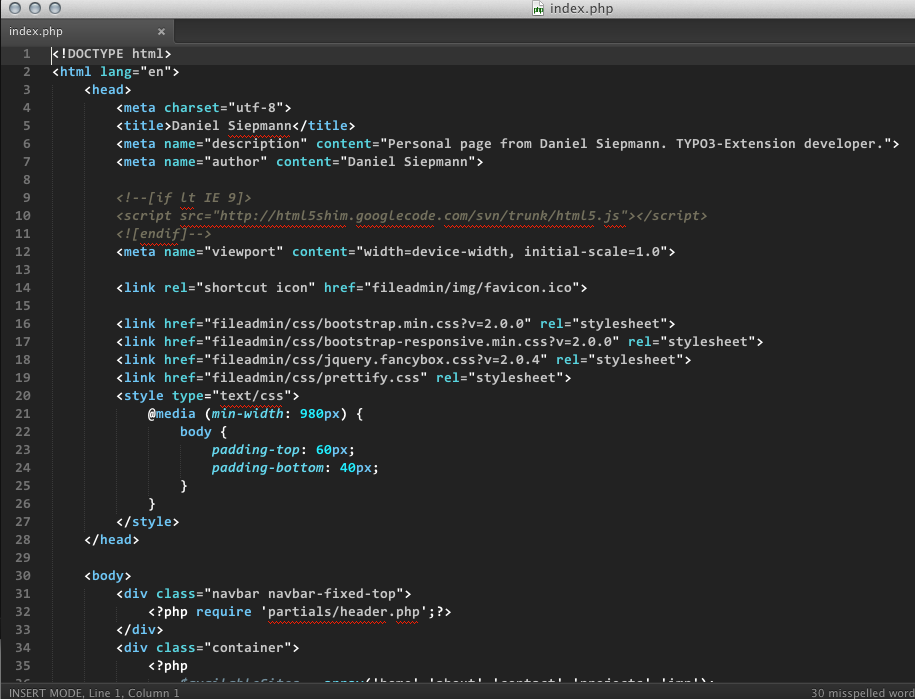
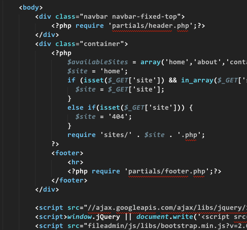

Sublime-Text-2
==============

Currently I just released my first Color Scheme.
Please notice, that is my very first work.
Feedback is always welcome.

Currently tested / supported Languages are:

- HTML
- CSS
- XML
- JavaScript (not well done)
- JSON (not well done)
- PHP
- Markdown

# Screens

